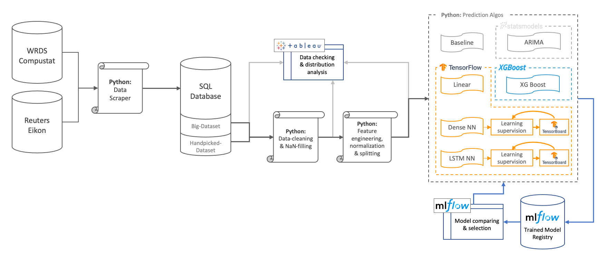

# Master Thesis: Predicting Company Earnings with AI Techniques
Predicting company earnings (Net income / ROE / dividends per share) with AI from company fundamentals (B/S, I/S, CF/S, ShrE/S).

## Abstract  
Corporate earnings prediction has always been an important subject for practitioners and accounting & investment research. A large body of prior re-search has examined the EPS forecasting accuracy of traditional methods, name-ly using regressions and time-series moving average models. With increasing data availability and computing power, Artificial Intelligence (AI) techniques have gained popularity in recent years. Those techniques promise to inde-pendently learn subtle and non-linear relationships and interaction effects in high-dimensional data, even without explicit theoretical guidance, helping un-cover new information from the financial statements beyond the extant models. However, literature applying AI techniques to predict corporate earnings using fundamental data remains very limited and results often contradict each other. This thesis leverages a large fundamental dataset from Reuters Revinitv along a time-series of over 20 years to compare Traditional against AI earnings predic-tion techniques. On this common dataset, different techniques are re-evaluated and compared against one and another. The results reveal the AI techniques out-perform Traditional techniques, with Gradient Boosting Trees being the best model. Additionally, I show that feature engineering is crucial for Neuronal Networks' performance. However, the mean absolute error of the best model, Gradient Boosting Tree, is relatively high with an average error of 26.8 to 29.4 percentage points making it useless for practical application.  
  
van Almsick, S. (2021). *Predicting Company Earnings with AI Techniques.* Master Thesis at Frankfurt School of Finance and Management [not published]

## Data-Flow/Process-Graphic
The approach is to apply best practices with the most widely used (and best considered) software and tools:


## 1. Getting the data *([folder: a](app/a_get_data))*
**Two methods:**
- **Big-Data-Method:** Downloading all data fields filled >= 66% form Reuters Eikon & WRDS Compustat
- **Handpicked-Method:** Download all key metrics/data fields specified in csv-file and intelligently fill NaNs with formulas and methods.  
  
Please see the [README_get_data.md](app/a_get_data/README_get_data.md) for detailed instructions/overview.  

## 2. Data cleaning and missing data handling *([folder: b](app/b_data_cleaning))*
Intelligent NaN filling *([see code here](app/b_data_cleaning/data_cleaning.py))* with formulas and methods specified in last columns beginning with "fillnan_" in [this csv-file](app/a_get_data/reuters_eikon/key_reuters_fields.csv).  

**Example for intelligent NaN-filling formulas and methods: *([see csv-file](app/a_get_data/reuters_eikon/key_reuters_fields.csv))***  

| Category | Name | Reuters Code | Clear Name | fillnan_1 | fillnan_2 |
| ------------- |:-------------:| -----:| -----:| -----:| -----:|
| General | Data date | TR.TotalReturn.date | data_date | | |
| Income Statement | Depreciation and amortization | TR.DepreciationDepletion+TR.Amortization | DeprArmo | formula:EBITDA-EBIT | formula:Depreciation+Amortization |
| Income Statement | EBIT | TR.EBIT | EBIT | formula:EBITDA-DeprArmo |  |
| Profitability | Tax Rate | TR.IncomeTaxRatePct | TaxRate | formula:Tax/PreTaxIncome*100 | method:linear(or=mean) |
| Ratios | Asset Turnover | TR.F.AssetTurnover | AssetTurnover | formula:Sales/TotalAssets |  |
  
**Available fillnan-methods are:**
- value (e.g. value:0 -> fill NaNs with 0)
- formula (e.g. formula:Sales/TotalAssets with the column names from the "Clear Name"-column)
- method
   - linear(or=mean) with or can be any number or "mean"
   - approx(other=COLUMN_NAME) with other being one or more other columns used to linearly approx that column e.g. approx(other=Sales) or approx(other=\[Sales, EBIT])
   
**To run this code: *([see code here](app/b_data_cleaning/data_cleaning.py))***
```python
## Get cleaned and filled data
# General params
recache_raw_data = False
redo_data_cleaning = False

# Dataset params: Option 1 manual props/overwriting props
data_version = 'handpicked_dataset'  # Get name from app/b_data_cleaning/_dataset_registry.py file
comp_col = 'ric'
time_cols = ['data_year', 'data_qrt']
industry_col = 'industry'

# Dataset params: Option 2 get props from registry
data_version = 'handpicked_dataset'  # Get name from app/b_data_cleaning/_dataset_registry.py file
from app.b_data_cleaning import get_dataset_registry
dataset_props = get_dataset_registry()[data_version]
comp_col = dataset_props['company_col']
time_cols = dataset_props['iter_cols']
industry_col = dataset_props['industry_col']

# Data dropping params
required_filled_cols_before_filling = ['sales']  # drop rows before NaN filling if columns NaN/not filled
required_filled_cols_after_filling = ['ebit', 'roe']  # drop rows after NaN filling if columns NaN/not filled
drop_threshold_row_pct = 0.25  # drop rows before NaN filling if columns of row are filled less than percent
drop_threshold_row_quantile = 0.2  # drop rows before NaN filling if columns of row are filled less than quantile percentage
drop_threshold_col_pct = 0  # drop columns before NaN filling if column is less percent filled
append_data_quality_col = False  # append 'data_quality' column with percentage of columns filled per row before NaN filling

# Run code
from app.b_data_cleaning.data_cleaning import get_clean_data
df_cleaned = get_clean_data(data_version, recache_raw_data=recache_raw_data, redo_data_cleaning=redo_data_cleaning, comp_col=comp_col, time_cols=time_cols, industry_col=industry_col, required_filled_cols_before_filling=required_filled_cols_before_filling, required_filled_cols_after_filling=required_filled_cols_after_filling, drop_threshold_row_pct=drop_threshold_row_pct, drop_threshold_row_quantile=drop_threshold_row_quantile, drop_threshold_col_pct=drop_threshold_col_pct, append_data_quality_col=append_data_quality_col)
print(df_cleaned)
```  

## 3. Data prep / feature engerneering *([folder: c](app/c_data_prep))*
- Feature engerneeing (ratios / pct-change / feature selection / etc. - [see code here](app/c_data_prep/i_feature_engineering.py))
```python
from app.c_data_prep.i_feature_engineering import feature_engerneeing
# Give cleaned data from (1.)
comp_col = 'ric'
time_cols = ['data_year', 'data_qrt']
industry_col = 'industry'
df_feature_engineered = feature_engerneeing(dataset=df_cleaned, comp_col=comp_col, time_cols=time_cols, industry_col=industry_col)
```
- Data normalization (mean-std dev normalization on block/time-step/compayn-time-step-level - [see code here](app/c_data_prep/ii_data_prep.py))
- Data sperating into training sets (caching final datasets for training to increase speed when training and feature turning - [see code here](app/c_data_prep/ii_data_prep.py))  

**Warning:** On non UNIX-systems (e.g. Windows) this part of the code might crash because code uses multi-core processing and uses by default the number of cores as number of simultaneous processes. This might lead to the system crashing. Set not to automatic num_processes=-1 but to a number of parallel processes your PC can handle.
```python
from app.c_data_prep.ii_data_prep import data_prep
# Give cleaned and feature engineered data from step before (2.1.)
y_cols = ['roe']
time_cols = ['data_year', 'data_qrt']
comp_col = 'ric'
keep_raw_cols = []  # columns to not normalize
drop_cols = []  # columns to drop 

# Initialize data-class
data = data_prep(dataset=df_feature_engineered, y_cols=y_cols, iter_cols=time_cols, comp_col=comp_col, keep_raw_cols=keep_raw_cols, drop_cols=drop_cols)

# Define rolling window size
data.window(input_width=5*4, pred_width=4, shift=1)

# Select one from three split methods
#data.single_time_rolling(val_time_steps=1, test_time_steps=1, shuffle=True)
data.block_rolling_split(val_comp_size=0, test_comp_size=0, train_time_steps=5*4*2, val_time_steps=1, test_time_steps=1, shuffle=True)
#data.block_static_split(val_comp_size=0, test_comp_size=0, val_time_size=0.2, test_time_size=0.1, shuffle=True)

# Select one from three normalization levels
#data.normalize(method='block')
data.normalize(method='time')
#data.normalize(method='set')

# Compute/cache the datsets
data.compute()

# Get one time-step dataset
out = data['200201_201903']
ds_train, ds_val, ds_test = data.tsds_dataset(out='all', out_dict=None)

# Export last time-step dataset to excel to inspect
data.export_to_excel()
```
  
## 4. Analyzes/Prediction *([folder: e](app/e_analyses))*
**All models ([all results](results)):** 
1. Baseline models *([code](app/e_analyses/a_TF_Baseline.py) / [validation results](results/results_baseline_models_val.csv) / [test results](results/results_baseline_models_test.csv) / [all runs](results/results_baseline_models_search.csv))*
    - last value: prediction = last period value
    - average value: prediction = average of n last periods (best n determined on validation dataset)
    - static value: prediction = value x (best x determined on validation dataset)
2. Regression *([code](app/e_analyses/b_TF_LiteratureFeatures_Linear.py) / [results](results/results_dense_lit_linear_error.csv) / [p-values](results/results_dense_lit_linear_pvalues.csv)  / [coefficients](results/results_dense_lit_linear_coef.csv))*
    - replication of Lev & Thiagarajan (1993)
3. Time-series models: ARIMA *([code](app/e_analyses/c_ARIMA.py) / [results & best models](results/results_ARIMA_model.csv) / [runs](results/results_ARIMA_search.csv))*
4. Machine Learning: XGBoost *([code](app/e_analyses/d_XGBoost.py) / [results](results/results_XGBoost_error.csv) / [best models](results/results_XGBoost_model.csv) / [all runs](results/results_XGBoost_search.csv))*
5. Neural Networks
    - Multi-Layer-Dense: 
      - just using Lev & Thiagarajan's (1993) features *([code](app/e_analyses/e_TF_LiteratureFeatures_Best.py) / [results](results/results_dense_lit_best_error.csv) / [best models](results/results_dense_lit_best_model.csv) / [all runs](results/results_dense_lit_best_search.csv))*
      - all features *([code](app/e_analyses/e_TF_AllFeatures_Best.py) / [results](results/results_dense_all_best_error.csv) / [best models](results/results_dense_all_best_model.csv) / [all runs](results/results_dense_all_best_search.csv))*
    - LSTM *([code](app/e_analyses/f_TF_LSTM.py))*
      - just using Lev & Thiagarajan's (1993) features *([results](results/results_lstm_lit_error.csv) / [best models](results/results_lstm_lit_model.csv) / [all runs](results/results_lstm_lit_search.csv))*
      - all features *([results](results/results_lstm_all_error.csv) / [best models](results/results_lstm_all_model.csv) / [all runs](results/results_lstm_all_search.csv))*
   